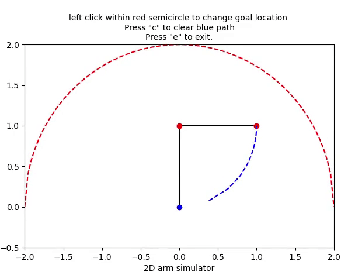

# Two Dimensional 2DoF Planar Manipulator
This is an interactive 2D robot arm simulator. It simulates two actuators and shows realtime animation along with trajectory followed by the end effector. It positions the end-effector to the location of the left click.
## Language used 
- Python-3.6.9

## Uses 
- Elementary implementation of Inverse and Forward kinematics.
- PID control implementation and effects of pid gains adjustments are easily visible.
- Introduction to basic matplotlib plotting and animation.

